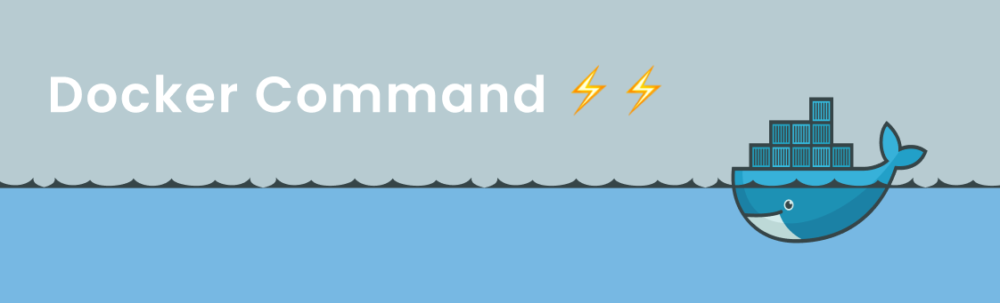

# Perintah-perintah dasar pada docker 🐳

- Melihat versi docker

```bash
$ docker version
```

- Melihat informasi tentang docker yang telah di instal

```bash
$ docker info
```

- Melihat daftar images

```bash
$ docker images
```

- Download images

```bash
$ docker pull mysql
```

perintah di atas merupakan contoh untuk mendownload images mysql, dengan menggunakan perintah seperti di atas secara default akan mendownload mysql dengan tag _latest_ atau versi paling baru, jika ingin mendownload versi lain dapat menggunakan perintah seperti berikut:

```bash
$ docker pull mysql:5.6 #tambahkan tag :5.6
```

- Menghapus images

```bash
$ docker image rm mysql:5.6
```

- Melihat daftar container yang sedang running

```bash
$ docker container ls
```

- Melihat daftar semua container

```bash
$ docker container ls --all
```

- Membuat container

```bash
$ docker container create mysql:5.6
```

Setiap container memiliki nama, dengan perintah di atas by default container tersebut akan memiliki random name, untuk memberikan nama secara spesifik gunakan perintah berikut:

```bash
$ docker container create --name mysqlserver mysql:5.6 #menambahkan nama container
```

- Membuat container dengan mengexpose port supaya dapat di akes dari luar container

```bash
$ docker container create --name mysqlserver mysql:5.6 -p 3306:3306 # portluar:portInternalContainer
```

- Manjalankan container

```bash
$ docker container start mysqlserver #contoh menjalakan contaier mysqlserver
```

- Menghentikan service container

```bash
$ docker container stop mysqlserver
```

- Menghapus container

```bash
$ docker container rm mysqlserver
```

- Build images manual dari dockerfile

```bash
$ docker build --tag namaImage:tags . # contoh node:12, fungsi '.' memberitahu bahwa kita akan build dockerfile yang ada pada direktori tersebut
```

## Membuat koneksi antar container

- Membuat network container

```bash
$ docker network create test_network
```

- Menambahkan container ke dalam network

```bash
$ docker network connect container1
$ docker network connect conatiner2
```

- Melihat daftar network

```bash
$ docker network ls
```
